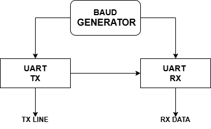
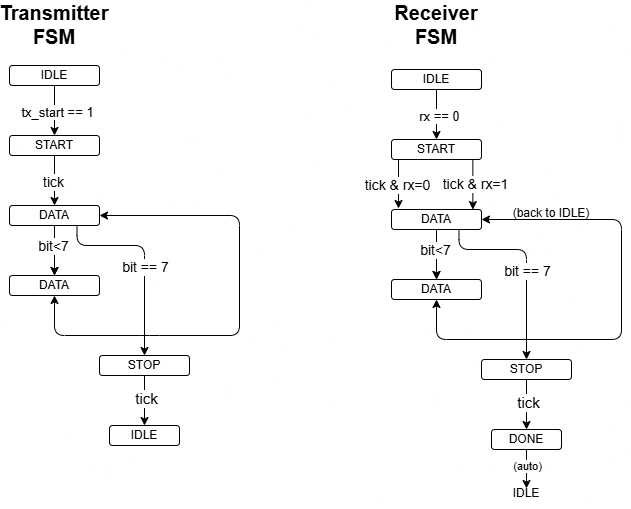
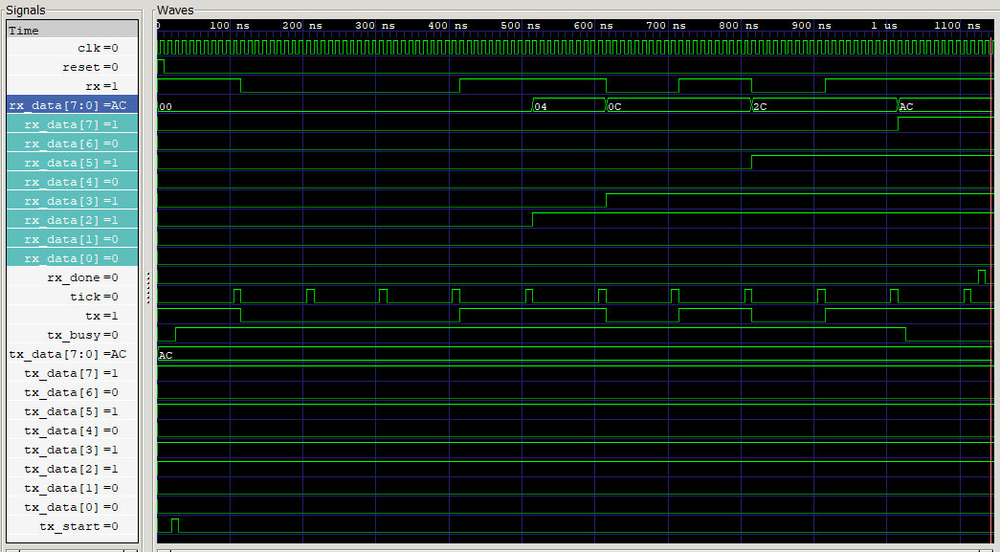

# UART Communication Controller using Verilog HDL

## Overview

A UART (Universal Asynchronous Receiver Transmitter) communication system implemented in Verilog HDL. The design includes a baud rate generator, UART transmitter, UART receiver, and a loopback testbench for functional verification.

## Features

- UART Transmitter (TX)
- UART Receiver (RX)
- Baud Rate Generator
- FSM-based communication control
- Loopback verification environment
- Simulation waveform generation

## Project Structure

- uart_tx.v : UART transmitter module
- uart_rx.v : UART receiver module
- baud_gen.v : Baud rate generation module
- uart_tb.v : Verification testbench

## Architecture

### UART Block Diagram

### FSM Diagram

## Verification

The transmitter output is connected directly to the receiver input in the testbench. Data transmitted by the UART transmitter is received and verified by the UART receiver.

### Simulation Waveform

## Tools Used

- Verilog HDL
- Icarus Verilog
- GTKWave

## Future Enhancements

- Parity bit support
- Configurable baud rate selection
- Multiple test-case verification
- Improved receiver oversampling

## Author

Bhuvan Malhotra
